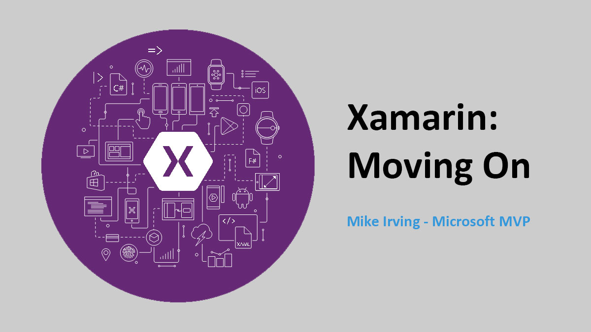
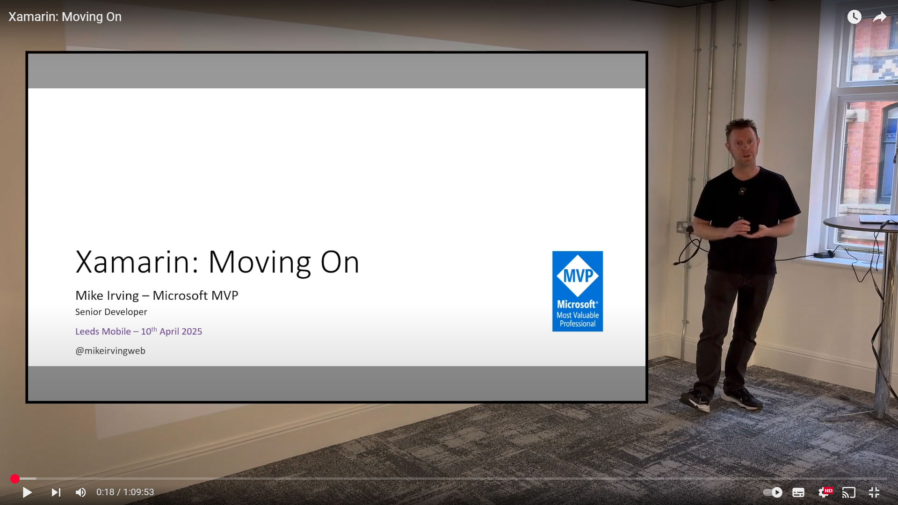
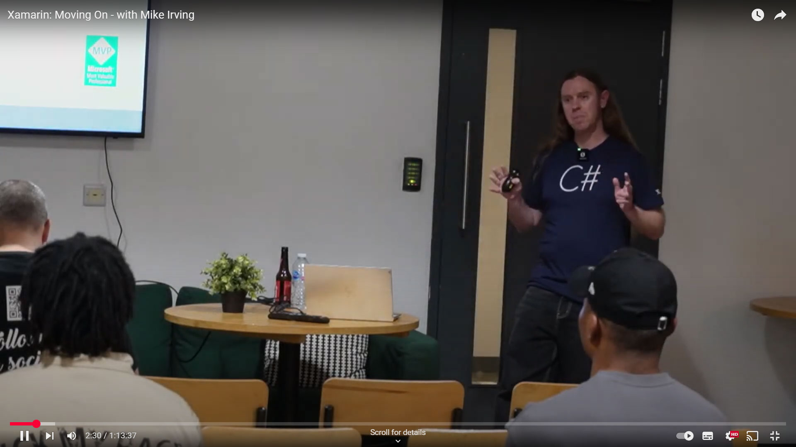

# Xamarin: Moving On  
Presentation repo for my Xamarin: Moving On talks  

## Forthcoming Talks
⏰ To be announced  

## Past Talks  
📅 Apr 10th 2025 - **Leeds Mobile** - [Website](https://www.meetup.com/leeds-mobile/events/306708871/) - [Slides](https://mikeirvingweb.s3.eu-west-2.amazonaws.com/xamarin-moving-on/2025-04-10-Mike-Irving-Xamarin-Moving-On.pptx)  
📅 Nov 12th 2024 - **Dot NET Liverpool** - [Website](https://www.meetup.com/dot-net-liverpool/events/302954625/) - [Slides](https://mikeirvingweb.s3.eu-west-2.amazonaws.com/xamarin-moving-on/2024-11-12-Mike-Irving-Xamarin-Moving-On.pptx)  
📅 Sep 11th 2024 - **Birmingham .NET & MAUI User Group** - [Website](https://www.meetup.com/birmingham-dotnet-and-xamarin-user-group/events/301176508) - [Slides](https://mikeirvingweb.s3.eu-west-2.amazonaws.com/xamarin-moving-on/2024-09-11-Mike-Irving-Xamarin-Moving-On.pptx)  
📅 Aug 29th 2024 - **.NET South West** - [Website](https://www.meetup.com/dotnetsouthwest/events/302996387/) - [Slides](https://mikeirvingweb.s3.eu-west-2.amazonaws.com/xamarin-moving-on/2024-08-29-Mike-Irving-Xamarin-Moving-On.pptx)  
📅 Aug 5th 2024 - **NSManchester** - [Website](https://www.meetup.com/nsmanchester/events/301980488/) - [Slides](https://mikeirvingweb.s3.eu-west-2.amazonaws.com/xamarin-moving-on/2024-08-05-Mike-Irving-Xamarin-Moving-On.pptx)  

## Recorded Versions  

🍿 From Apr 10th 2025 @ **Leeds Mobile** - [YouTube](https://www.youtube.com/watch?v=HOVmmkAPnmU)  

🍿 From Nov 12th 2024 @ **Dot NET Liverpool** - [YouTube](https://www.youtube.com/watch?v=hHh3Xr45RYw&t=132s)  

### Links from presentation  

🪦 [Microsoft: Xamarin - End of Life](https://dotnet.microsoft.com/en-us/apps/xamarin)  
🆘 [Microsoft: Xamarin Support Policy](https://dotnet.microsoft.com/en-us/platform/support/policy/xamarin)  
⬆️ [Microsoft Learn: Upgrade from Xamarin to .NET](https://learn.microsoft.com/en-gb/dotnet/maui/migration/?WT.mc_id=MVP_307078)  
⬆️ [Microsoft Learn: Upgrade Xamarin.Android, Xamarin.iOS, and Xamarin.Mac projects to .NET](https://learn.microsoft.com/en-gb/dotnet/maui/migration/native-projects?view=net-maui-8.0&WT.mc_id=MVP_307078)  
⬆️ [.NET Upgrade Assistant](https://marketplace.visualstudio.com/items?itemName=ms-dotnettools.upgradeassistant)  

**Visual Studio for Mac (formerly Xamarin Studio)**  
🪦 [vsMac - End of Life](https://devblogs.microsoft.com/visualstudio/visual-studio-for-mac-retirement-announcement/?WT.mc_id=MVP_307078)  
🧑‍💻 [Visual Studio Code](https://code.visualstudio.com/?WT.mc_id=MVP_307078)  
🧠 [JetBrains Rider](https://www.jetbrains.com/rider/)  

**Visual Studio App Center (formerly HockeyApp)**  
⚙️ [Visual Studio App Center](https://appcenter.ms/)  
☁️ [Azure DevOps](https://azure.microsoft.com/en-gb/products/devops?WT.mc_id=MVP_307078)  
🦑 [GitHub Actions](https://docs.github.com/en/actions)  
🗒️ [Microsoft Learn: Visual Studio App Center Retirement](https://learn.microsoft.com/en-us/appcenter/retirement?WT.mc_id=MVP_307078)  

**.NET MAUI**  
📱 [.NET MAUI](https://dotnet.microsoft.com/en-us/apps/maui)  
🐵 [Microsoft Learn: .NET MAUI Training](https://learn.microsoft.com/en-us/training/paths/build-apps-with-dotnet-maui/?WT.mc_id=MVP_307078)  

**C# Alternatives**  
🧩 [Uno Platform](https://platform.uno/)  
⬆️ [Uno Platform - info for Xamarin.Forms Developers](https://platform.uno/xamarin-forms/)  
📲 [Avalonia UI](https://avaloniaui.net/)  

**Native**  
🐦 [Swift](https://swift.org/)  
🤖 [Kotlin](https://kotlinlang.org/)  

**Other Cross-Platform Tools**  
▶️ [Flutter](https://flutter.dev/)  
⚛️ [React Native](https://reactnative.dev/)  
🤖 [Kotlin Multiplatform](https://kotlinlang.org/docs/multiplatform.html)  

**Other links**  
🦍 [Mono Project](https://www.mono-project.com/)  
🍷 [Scott Hanselman - Mono Project donated to Wine](https://x.com/shanselman/status/1828864622553960509)  

---
For more info, find / contact me at:  
[Bluesky](https://bsky.app/profile/mikeirvingweb.bsky.social) • [X / Twitter](https://x.com/mikeirvingweb) • [LinkedIn](https://www.linkedin.com/in/mikeirving) • [GitHub](https://github.com/mikeirvingweb) • [Sessionize](https://sessionize.com/mikeirving/) • [Stack Overflow](https://stackoverflow.com/users/482901/mike-irving) • [Website & Blog](https://www.mike-irving.co.uk/)
